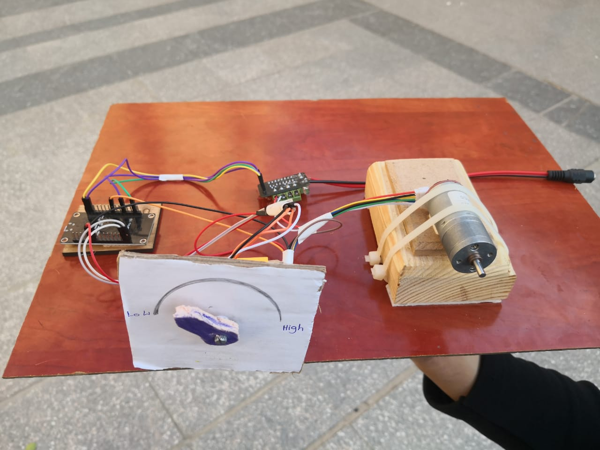

# PI-Controller-Arduino
 PI Controller to Lock the speed of the DC motor to the desired value using NodeMCU

## System Response

## Block Diagram

## Electrical Wiring

## Demo Video
[Demo](https://drive.google.com/file/d/1NwRlz7FJXZMaVko7zRp21GBysGFLGzub/view?usp=share_link)